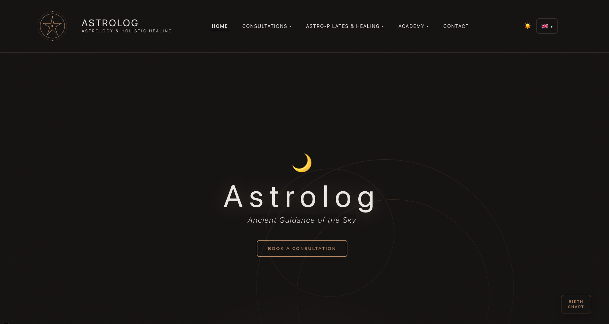
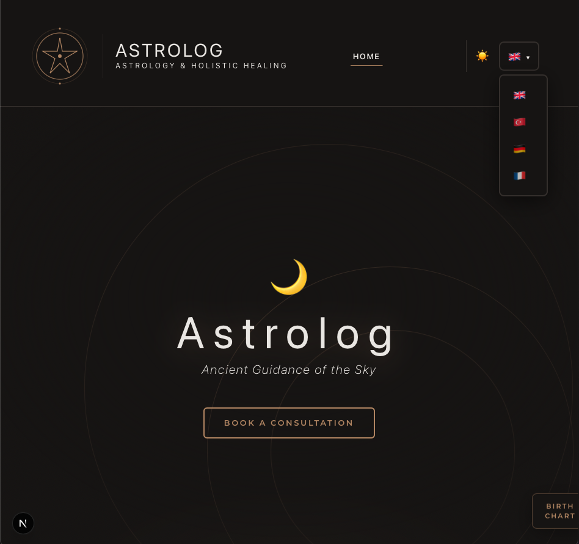
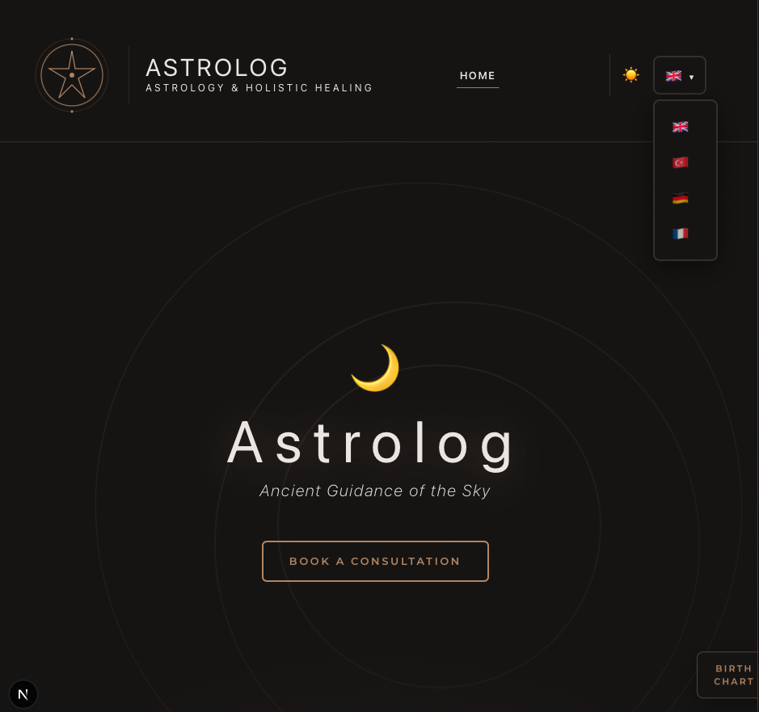

Multilingual site for **Astrology & Holistic Healing** — brand **Luminosa**.
Next.js 16, React 19, Tailwind v4, Framer Motion. TR, EN, DE, FR.

---

## Screenshots

`public/1.png`, `public/2.png`, `public/3.png`.

| |
| :---: |
|  |
| *Home — hero* |

| |
| :---: |
|  |

| |
| :---: |
|  |

---

## Tech Stack

| Area      | Stack                                     |
| --------- | ----------------------------------------- |
| Framework | Next.js 16 (App Router)                   |
| UI        | React 19, Tailwind CSS v4, Framer Motion  |
| Language  | TypeScript                                |
| Fonts     | Google Fonts (Cinzel, Montserrat)         |
| i18n      | In-app `translations.ts` (en, tr, de, fr) |

---

## Project Structure

```
src/
├── app/
│   ├── [lang]/                    # Locale: tr, en, de, fr
│   │   ├── layout.tsx             # Root layout, Navbar, Footer, theme
│   │   ├── page.tsx               # Home (HeroSection + ZodiacSection)
│   │   ├── consultations/        # Birth chart, Synastry, Karmic, etc.
│   │   ├── healing/               # Sessions, events, sub-pages
│   │   ├── academy/               # Beginner, recordings, blog, sky-calendar
│   │   ├── free-chart/
│   │   └── contact/
│   └── globals.css                # Theme vars, hero, nav, footer, zodiac
├── components/
│   ├── hero/
│   │   ├── HeroSection.tsx        # Parallax rings, stagger, CTA fill, floating box
│   │   └── MoonPhase.tsx          # Dynamic moon phase (hero variant: gradient + glow)
│   ├── home/
│   │   └── ZodiacSection.tsx      # Scroll reveal, element-based hover glow
│   ├── navbar/
│   │   └── Navbar.tsx             # Logo, mega dropdowns, theme/lang, CTA
│   └── footer/
│       └── Footer.tsx             # Brand, tagline, social links, quick links
├── constants/
│   ├── navConfig.ts               # NAV_ITEMS, NAV_CTA
│   ├── nav.ts
│   └── footer.ts                  # Social links (YouTube, LinkedIn, etc.)
├── i18n/
│   └── translations.ts            # t(), getTranslations, locale copy
└── lib/
    ├── fonts.ts
    └── moonPhase.ts               # getMoonPhase(), getMoonPhaseId() for today's phase
public/
├── 1.png, 2.png, 3.png            # Screenshots
```

---

## Getting Started

```bash
npm install
npm run dev   # http://localhost:3000
npm run build
npm start
```

Root `/` redirects to `/tr`.

---

## Locales & Routes

- **tr** (default), **en**, **de**, **fr**
- URLs: `/[lang]/...` (e.g. `/en/consultations/birth-chart`)
- Nav: click-to-open dropdowns (Consultations, Healing, Academy), theme toggle, language selector

---

## Design

- **Theme:** CSS vars in `globals.css` — `--theme-bg`, `--theme-text`, `--theme-border`; dark mode `[data-theme="dark"]`.
- **Accent:** `#b3916e` (astro-gold) — buttons, links, logo, hero.
- **Fonts:** Cinzel (headings / luxury), Montserrat (body); italic extralight for hero subtitle.
- **Hero:** Layered parallax (slow-rotating rings), **dynamic moon phase** (today’s phase, gradient + glow in hero), stagger slide-up, CTA left-to-right fill, floating “Birth Chart” box (i18n).
- **Home:** “Your Sky Guide” zodiac section — scroll-triggered stagger reveal, element-based hover glow (fire/earth/air/water).
- **Logo:** SVG — outer ring, inner ring, 8-point star, dots; brand name “Luminosa” in nav/footer.
- **Responsive:** Mobile hamburger, dropdowns in portal with fixed position, hero and nav scale for small screens.

---

## Features

- [x] Multi-language (tr, en, de, fr) and language switcher
- [x] Nav: logo, Consultations / Healing / Academy mega dropdowns (click), CTA “Free Chart”, theme + lang
- [x] Home: hero (parallax rings, dynamic moon phase, stagger, CTA, floating box), ZodiacSection (scroll reveal, element glow)
- [x] Footer: brand Luminosa, tagline, social links (YouTube, LinkedIn, Instagram, X, Facebook), quick links, copyright
- [x] Consultations: Birth Chart, Synastry, Karmic, Spiritual, Business, Electional
- [x] Healing: sessions + events groups; Academy: beginner, recordings, blog, sky-calendar
- [x] Dark/light theme
- [x] Responsive layout and nav

---

## Roadmap

- [ ] Content: About, localized copy
- [ ] Contact: form / map
- [ ] CTA: booking or contact flow
- [ ] SEO: per-page and per-locale metadata
- [ ] Backend / admin if needed

---

## License

Private use.
